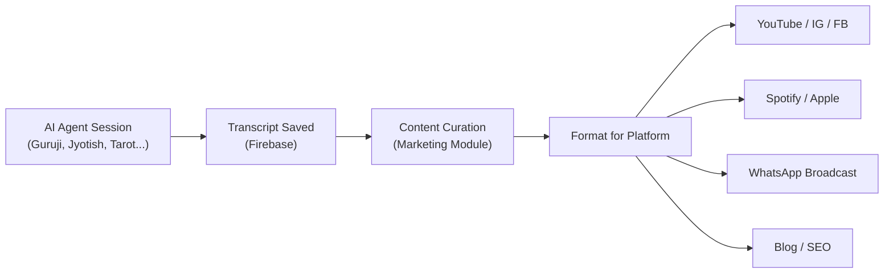
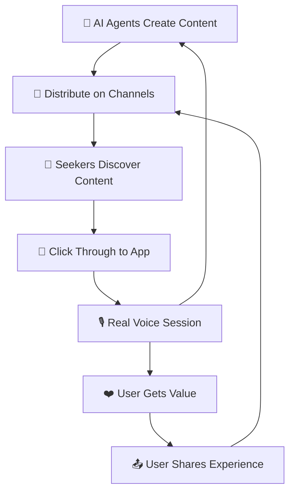

# 🕉️ RRAASI Satsang — Content Marketing & Distribution Strategy

## The Big Idea

**Use the app's own AI agents as content factories** — every agent conversation, bhajan, kundli reading, tarot session, meditation, and discourse is raw material for short-form and long-form spiritual content. Distribute it across channels to attract seekers back to the app.

> [!TIP]
> The app already has 8 AI agents, YouTube integration, music creation, and a marketing pipeline (SendGrid + Twilio + OpenAI). This plan leverages *what already exists* to create a content engine.

---

## 1. Content Pillars (What to Create)

Each agent maps to a content pillar. Every pillar produces multiple formats:

| Agent | Content Pillar | Content Types |
|---|---|---|
| **Guruji** | Spiritual Q&A | "Ask Guruji" shorts, daily wisdom clips, pravachan highlights |
| **Osho** | Radical Wisdom | Provocative quotes, discourse snippets, "Osho says..." reels |
| **Music Agent** | Devotional Music | Bhajan clips, lyric videos, artist spotlights, "Bhajan of the Day" |
| **Hinduism Agent** | Dharma Knowledge | Festival explainers, scripture deep-dives, mythology shorts |
| **Vedic Jyotish** | Astrology & Kundli | Daily/weekly rashifal, nakshatra explainers, "Your Week in Stars" |
| **Tarot Agent** | Mystical Guidance | Daily card pull, card meaning shorts, "Pick a Card" interactive |
| **Meditation Agent** | Inner Peace | Guided meditation clips, breathing exercises, "Calm in 60s" |
| **Trance Music Guide** | Spiritual Soundscapes | Ambient loops, meditation music, "Sound Bath" previews |

---

## 2. Content Formats & Templates

### 🎬 Short-Form Video (YouTube Shorts / Instagram Reels / Facebook Reels)

| Format | Duration | Cadence | Example |
|---|---|---|---|
| "Ask Guruji" Q&A | 30–60s | Daily | User asks "कर्म क्या है?" → Guruji explains |
| Daily Rashifal | 30–45s | Daily | "मेष राशि — आज का दिन" with animated chart |
| Bhajan of the Day | 30–60s | Daily | Clip from music agent + lyrics overlay |
| "Pick a Card" Tarot | 45–60s | 3x/week | Choose card → reveal + meaning |
| 60-Second Meditation | 60s | Daily | Guided breathing with ambient music |
| Osho One-Liner | 15–30s | Daily | Bold quote on mystic background |
| Festival Countdown | 30s | Seasonal | "नवरात्रि Day 3: माँ चंद्रघंटा" |
| Scripture in 60s | 60s | 3x/week | One Gita shloka, explained simply |

### 📻 Podcast / Audio Content

| Format | Duration | Cadence | Platform |
|---|---|---|---|
| Daily Satsang Podcast | 5–10 min | Daily | Spotify, Apple, YouTube |
| Weekly Rashifal Deep Dive | 15–20 min | Weekly | Spotify, Apple |
| Bhajan Jukebox | 30–60 min | Weekly | YouTube, Spotify |
| Guided Meditation Series | 10–20 min | 2x/week | Spotify, Apple, YouTube |

### 📝 Written / Social Media Posts

| Format | Cadence | Platform |
|---|---|---|
| Daily Shloka + Meaning (Hindi/English) | Daily | Instagram, Facebook, X |
| Astrology Weekly Forecast | Weekly | Blog, Instagram Carousel |
| Festival Guide + Rituals | Seasonal | Blog, WhatsApp Broadcast |
| "Did You Know?" Dharma Facts | 3x/week | X, Instagram Stories |

---

## 3. Content Production Pipeline (Using the App)

This is the key differentiator — **the app IS the production tool**:

### Step-by-Step

1. **Record** — Run real sessions with each agent (or use best user sessions with consent)
2. **Transcribe** — Already happening via `marketing/transcripts` module
3. **Curate** — Pick the best Q&A exchanges, insights, bhajans
4. **Format** — Use existing tools:
   - Music Agent → generates bhajans → MP3 → convert to MP4 for YouTube (Suno integration exists)
   - Transcripts → text overlays for reels
   - Rashifal data → automated daily posts
5. **Distribute** — Push to all channels using the marketing pipeline

---

## 4. Distribution Channels

### Tier 1: Primary (Daily Presence)

| Channel | Content Focus | Why |
|---|---|---|
| **YouTube** | Shorts + full videos + bhajans | Largest Hindi spiritual audience; OAuth already integrated |
| **Instagram** | Reels + Stories + Carousels | Visual-first; great for tarot, astrology, quotes |
| **WhatsApp** | Daily wisdom + rashifal broadcast | Already integrated via Twilio; most personal touch |
| **Facebook** | Reels + Groups + Page posts | Older demographic (35+); satsang communities |

### Tier 2: Growth (3x/week)

| Channel | Content Focus | Why |
|---|---|---|
| **Spotify / Apple Podcasts** | Satsang podcast + meditation + bhajans | Audio-first users; passive consumption |
| **X (Twitter)** | One-liners + shlokas + astrology bites | Quick engagement; viral potential |
| **Telegram** | Daily horoscope channel + satsang group | Community building; push notifications |
| **Blog (SEO)** | Long-form Hindi spiritual content | Google search traffic for Hindi queries |

### Tier 3: Experimental

| Channel | Content Focus |
|---|---|
| **Koo / ShareChat** | Hindi-first platforms; regional reach |
| **Pinterest** | Infographics: chakra maps, deity info, mantra cards |
| **Threads** | Spiritual micro-content |

---

## 5. Weekly Content Calendar

| Day | Short Video | Audio | Social Post | WhatsApp |
|---|---|---|---|---|
| **Mon** | Ask Guruji Q&A | Daily Satsang Podcast | Weekly Rashifal Carousel | Morning Wisdom |
| **Tue** | Bhajan of the Day | — | Scripture Shloka | — |
| **Wed** | Pick-a-Card Tarot | Guided Meditation | Did You Know? Dharma | Rashifal Update |
| **Thu** | Daily Rashifal | Daily Satsang Podcast | Osho Quote Card | — |
| **Fri** | 60-Second Meditation | Bhajan Jukebox | Festival/Event Post | Bhajan Share |
| **Sat** | Osho One-Liner | Weekly Rashifal Deep Dive | Blog Post Promo | Weekend Satsang Invite |
| **Sun** | Scripture in 60s | Guided Meditation | Community Highlight | Weekly Digest |

**Total output: ~35 content pieces/week** (most can be auto-generated or semi-automated from agent sessions)

---

## 6. Automation Opportunities (Already Built or Easy to Build)

| What | Status | How |
|---|---|---|
| Daily Rashifal generation | ✅ Agent exists | Schedule `vedic_astrology_agent` to produce daily content |
| Bhajan audio clips | ✅ Music agent + YouTube | Clip best moments, add lyrics overlay |
| WhatsApp broadcast | ✅ Twilio integrated | Trigger via `marketing-service.ts` |
| Email campaigns | ✅ SendGrid integrated | Weekly digest with best content |
| AI-generated captions | ✅ OpenAI in marketing service | `generateAIContent()` for platform-specific copy |
| Transcript → content | ✅ Transcripts module exists | `marketing/transcripts` page for curation |
| Publish to YouTube | ✅ YouTube OAuth exists | Use existing upload flow for bhajans/videos |
| Podcast RSS | 🔨 Needs building | Auto-generate feed from daily satsang audio |

---

## 7. Growth Tactics

### 🔁 Viral Loops
- **"Share Your Rashifal"** — After a Jyotish session, generate a shareable card with the user's rashifal → WhatsApp/IG share
- **"Guruji Said..."** — Let users share their favorite Guruji answers as quote cards
- **"My Tarot Card Today"** — Shareable daily card pull result

### 📅 Festival Marketing Sprints
- **Navratri** (9 days) — Daily Devi content, special bhajans, 9-day meditation challenge
- **Diwali** — Ram Katha series, lakshmi puja guide, festive bhajans
- **Janmashtami** — Krishna Q&A with Guruji, special bhajan playlist
- **Maha Shivaratri** — Shiva discourse series, overnight satsang event

### 🤝 Collaboration
- Invite bhajan artists to create content WITH the music agent
- Partner with temples for QR code access to daily satsang
- Collaborate with Hindi spiritual YouTubers for "Guruji vs Guru" segments

### 📊 SEO Content Hubs (Hindi)
Target search queries like:
- "कर्म क्या है" (What is Karma)
- "आज का राशिफल" (Today's Horoscope)
- "कृष्ण भजन" (Krishna Bhajans)
- "ध्यान कैसे करें" (How to Meditate)

Each hub links back to the app's relevant agent for a live voice experience.

---

## 8. Metrics to Track

| Category | Metric | Target (Month 1) |
|---|---|---|
| **Reach** | Total impressions across platforms | 100K |
| **Engagement** | Avg. engagement rate (likes+comments+shares / reach) | 5%+ |
| **Traffic** | Click-throughs to app | 2,000 |
| **Signups** | New users from content | 500 |
| **Retention** | Content-acquired users returning D7 | 30% |
| **Content Volume** | Pieces published/week | 30+ |
| **WhatsApp** | Broadcast list subscribers | 1,000 |
| **YouTube** | Subscriber growth | 500 |

---

## 9. Quick Wins (Start This Week)

| # | Action | Effort | Impact |
|---|---|---|---|
| 1 | Record 7 "Ask Guruji" sessions → edit into shorts | 2 hours | 7 videos ready |
| 2 | Generate daily rashifal → post as IG/FB carousel | 30 min/day | Daily presence |
| 3 | Pick 7 best bhajans → clip 30s each → YouTube Shorts | 1 hour | Music content live |
| 4 | Set up WhatsApp broadcast with daily shloka | 1 hour | Direct engagement |
| 5 | Create a "Pick a Card" tarot reel template | 1 hour | Highly shareable format |
| 6 | Write 3 Hindi SEO blog posts (karma, meditation, bhakti) | 3 hours | Long-term search traffic |
| 7 | Enable auto-share from rashifal results in app | 2 hours dev | Viral loop activated |

---

## 10. The Flywheel

**The app creates the content → content brings users → users create more content → repeat.**

This is not a traditional marketing plan where you hire a content team. The **AI agents ARE the content team**. Every session is a potential piece of content. Every bhajan is a potential YouTube video. Every rashifal is a potential daily post.

---
